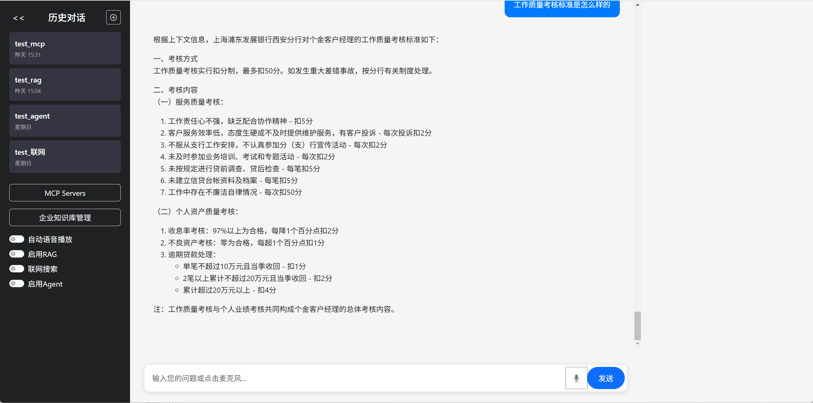
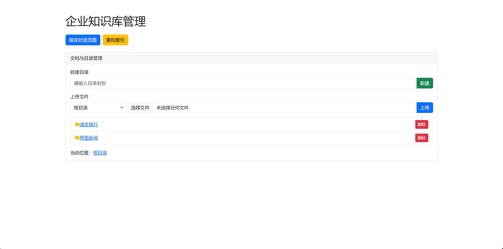
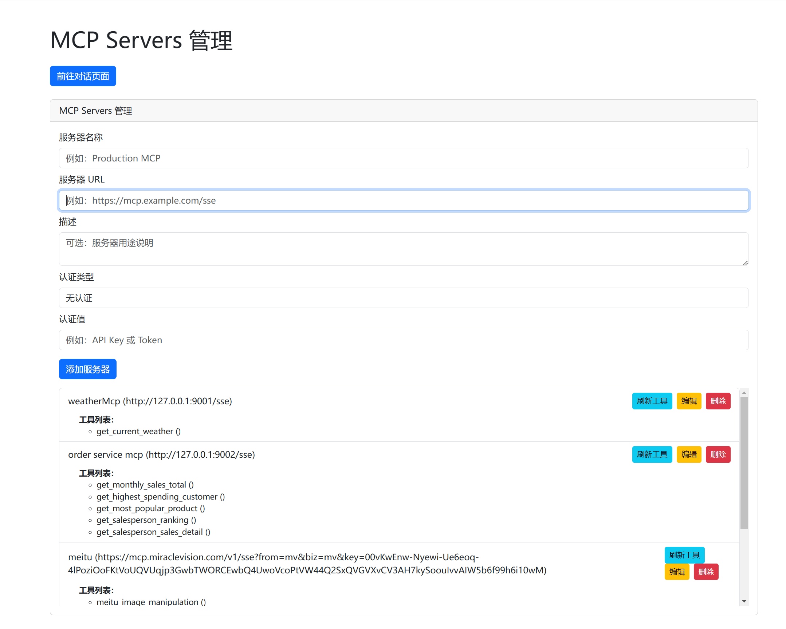

# AI搜索与MCP技术实战项目说明文档

## 项目概述

这是一个基于FastAPI的AI搜索与MCP（Model Context Protocol）技术实战项目，集成了智能问答、网络搜索、MCP工具调用等功能。项目采用微服务架构，包含主服务、MCP服务器和前端界面。

## 目录结构

```
app/
├── main.py                 # FastAPI主服务，提供聊天和搜索功能
├── mcp_api.py             # MCP服务管理API，处理MCP服务器的CRUD操作
├── requirements.txt        # Python依赖包列表
├── Dockerfile             # Docker容器化配置
├── supervisord.conf       # 进程管理配置，管理多个服务
├── chat_history.db        # SQLite数据库，存储聊天记录和MCP服务器信息
├── test_search.py         # 搜索功能测试脚本
├── logs/                  # 日志文件目录
├── static/                # 静态文件目录
│   ├── chat.html         # 聊天界面前端页面
│   └── mcp.html          # MCP管理界面前端页面
└── mcp_server/           # MCP服务器目录
    ├── __init__.py       # Python包初始化文件
    ├── weather_service.py # 天气查询MCP服务
    └── order_service.py  # 订单查询MCP服务
```

## 文件功能详细说明

### 核心服务文件

#### 1. `main.py` - 主服务文件
**主要功能：**
- FastAPI主应用，提供聊天和搜索API
- 集成AI大模型（OpenAI）进行智能问答
- 支持网络搜索（BochaAI API）
- 聊天历史管理（创建、查询、删除、导出）
- 流式响应处理
- 数据库初始化和管理

**关键API端点：**
- `GET /api/stream` - 流式聊天接口
- `GET /api/chat/history` - 获取聊天历史
- `GET /api/chat/session/{session_id}` - 获取特定会话
- `DELETE /api/chat/session/{session_id}` - 删除会话
- `GET /api/chat/export/{session_id}` - 导出会话
- `GET /api/health` - 健康检查

#### 2. `mcp_api.py` - MCP服务管理API
**主要功能：**
- MCP服务器的CRUD操作
- MCP工具发现和管理
- 与MCP服务器的通信（SSE/STDIO）
- 工具注册和刷新

**关键API端点：**
- `POST /api/mcp/servers` - 创建MCP服务器
- `GET /api/mcp/servers` - 列出所有MCP服务器
- `GET /api/mcp/servers/{server_id}` - 获取特定服务器
- `PUT /api/mcp/servers/{server_id}` - 更新服务器
- `DELETE /api/mcp/servers/{server_id}` - 删除服务器
- `POST /api/mcp/servers/{server_id}/refresh-tools` - 刷新工具
- `GET /api/mcp/tools` - 列出所有工具

### MCP服务器

#### 3. `mcp_server/weather_service.py` - 天气查询服务
**主要功能：**
- 提供天气查询工具
- 支持中国主要城市的天气查询
- 集成第三方天气API
- 城市编码映射

**工具函数：**
- `get_current_weather(province: str, city: str)` - 获取指定城市天气

#### 4. `mcp_server/order_service.py` - 订单查询服务
**主要功能：**
- 提供订单数据分析工具
- 基于SQLite数据库的订单查询
- 销售统计和分析

**工具函数：**
- `get_monthly_sales_total(month: int)` - 获取月度销售总额
- `get_highest_spending_customer()` - 获取消费最高用户
- `get_most_popular_product()` - 获取最受欢迎产品
- `get_salesperson_ranking(limit: int)` - 获取销售员排行榜

### 配置文件

#### 5. `requirements.txt` - 依赖管理
**主要依赖：**
- `fastapi` - Web框架
- `uvicorn` - ASGI服务器
- `fastmcp==2.2.5` - MCP协议实现
- `openai==1.75.0` - OpenAI API客户端
- `requests` - HTTP请求库
- `python-dotenv==1.1.0` - 环境变量管理

#### 6. `Dockerfile` - 容器化配置
**主要功能：**
- 基于Python 3.10-slim镜像
- 安装supervisor进程管理器
- 暴露端口8000、9001、9002
- 使用supervisord启动所有服务

#### 7. `supervisord.conf` - 进程管理配置
**管理的服务：**
- `fastapi` - 主服务（端口8000）
- `weather_service` - 天气MCP服务（端口9001）
- `order_service` - 订单MCP服务（端口9002）

### 前端界面

#### 8. `static/chat.html` - 聊天界面
**主要功能：**
- 实时聊天界面
- 支持流式响应显示
- 聊天历史管理
- 会话导出功能

#### 9. `static/mcp.html` - MCP管理界面
**主要功能：**
- MCP服务器管理
- 工具发现和调用
- 服务器状态监控

## 系统架构和流程

### 整体架构
```
用户请求 → FastAPI主服务 → AI大模型 → MCP工具调用 → 返回结果
                ↓
        聊天历史存储 ← SQLite数据库
                ↓
        MCP服务器管理 ← MCP API
```

### 详细流程

#### 1. 聊天流程
1. 用户发送消息到 `/api/stream`
2. 主服务接收请求，检查是否需要网络搜索
3. 如果启用网络搜索，调用BochaAI API获取实时信息
4. 构建AI请求，包含用户消息、搜索结果和MCP工具信息
5. 调用OpenAI API进行智能问答
6. 流式返回AI响应
7. 保存聊天记录到数据库

#### 2. MCP工具调用流程
1. 用户询问涉及工具的问题（如天气、订单）
2. AI模型识别需要调用MCP工具
3. 主服务通过MCP Client连接到对应的MCP服务器
4. 调用相应的工具函数（如天气查询、订单统计）
5. 获取工具执行结果
6. 将结果返回给AI模型进行总结
7. 最终返回给用户

#### 3. MCP服务器管理流程
1. 管理员通过MCP管理界面添加MCP服务器
2. 系统自动发现服务器提供的工具
3. 将工具信息存储到数据库
4. 在聊天时可以自动调用这些工具

### 数据流

#### 数据库表结构
- `chat_sessions` - 聊天会话表
- `messages` - 聊天消息表
- `mcp_servers` - MCP服务器表
- `mcp_tools` - MCP工具表

#### 环境变量配置
- `API_KEY` - OpenAI API密钥
- `BASE_URL` - OpenAI API基础URL
- `MODEL_NAME` - 使用的模型名称
- `BOCHAAI_SEARCH_API_KEY` - BochaAI搜索API密钥

## 部署和运行

### 本地开发
```bash
# 安装依赖
pip install -r requirements.txt

# 启动主服务
uvicorn main:app --host 0.0.0.0 --port 8000

# 启动天气MCP服务
uvicorn mcp_server.weather_service:app --host 0.0.0.0 --port 9001

# 启动订单MCP服务
uvicorn mcp_server.order_service:app --host 0.0.0.0 --port 9002
```

### Docker部署
```bash
# 构建镜像
docker build -t project-search .

# 运行容器
docker run -p 8000:8000 -p 9001:9001 -p 9002:9002 project-search
```

## 技术特点

1. **微服务架构** - 主服务与MCP服务分离，便于扩展
2. **流式响应** - 支持实时流式聊天响应
3. **工具集成** - 通过MCP协议集成外部工具
4. **智能搜索** - 集成网络搜索增强AI回答能力
5. **数据持久化** - 使用SQLite存储聊天历史和配置
6. **容器化部署** - 支持Docker一键部署
7. **进程管理** - 使用supervisor管理多个服务进程

## 扩展建议

1. **添加更多MCP服务** - 如翻译、计算、文件处理等
2. **支持更多AI模型** - 集成其他大语言模型
3. **增强搜索功能** - 支持更多搜索源和搜索类型
4. **用户认证** - 添加用户登录和权限管理
5. **监控和日志** - 添加更完善的监控和日志系统
6. **性能优化** - 添加缓存、负载均衡等 

# 项目截图



